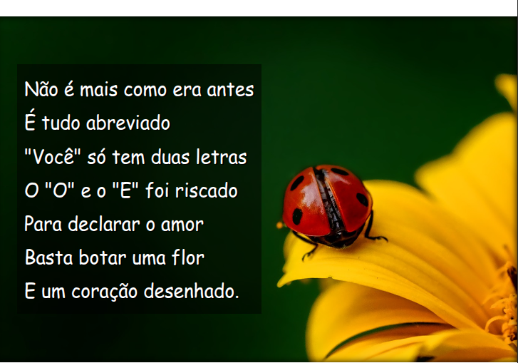

# Cordel Moderno

Página desenvolvida em **HTML** e **CSS** .

---

## 🚀 Tecnologias
- HTML5
- CSS3

---

## 📚 O que aprendi nesse projeto
- Conceitos básicos e preparação do ambiente.  
- Semântica do HTML5: textos, títulos, ligações, estilos.  
- colocar fontes no projeto
- Imagem com efeito Parallax 

---

## 🖼 Preview

---

## 🔗 Ver Projeto Online

---

📝 Projeto criado para estudos e prática de desenvolvimento web.  
Feito por **Arthur Jefferson**.
